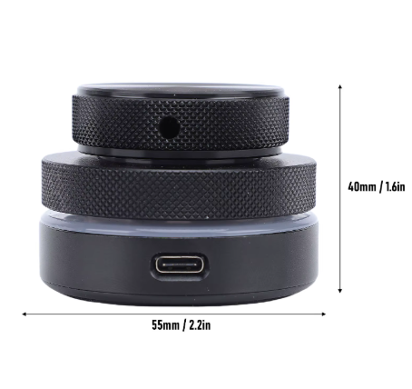

# ⌨️ WebHID Macro Pad Configurator & Keypad Companion

[English](#english) | [Русский](#русский)

---

## English

> [!WARNING]
> This configurator is designed specifically for the **Concentric Double Dial** macro pad (featuring two concentric rotating rings/wheels, 55mm base diameter, 40mm height) and similar keypads using the Ch57x protocol. It may not work with other standard macro pads.
> 
> 

A modern, glassmorphic web configurator and companion application for USB macro keypads. It allows you to remap keys, configure knobs, set RGB lighting, and automatically switch layout profiles based on the active application.

### ✨ Features
- **Direct WebHID Programming:** Configure your macro pad directly from your browser without installing heavy software.
- **Keypad Visualizer:** Interactive UI supporting multiple layouts (3 keys, 6 keys, 12 keys, concentric knobs, etc.).
- **Rich Mapping Options:** Standard keyboard keys, modifiers, multimedia keys, and custom mouse actions/gestures.
- **Keypad Companion:** A standalone lightweight Windows background application (`Keypad_Companion.exe`) that automatically monitors the active window and swaps macro pad profiles instantly.
- **AppData Redirection:** Configuration is saved in `%LOCALAPPDATA%\keypad-remap\profiles_daemon.json` (runs cleanly as a single executable).

### 🚀 Quick Start
1. **Open the Configurator:**
   Go to the live website hosted on **GitHub Pages**: https://darkassassinua.github.io/keypad-remap/
2. **Connect Device:**
   Click **"Connect Device"** and select your macro pad.
3. **Configure Profiles:**
   Create profiles (e.g., Photoshop, Spotify, Chrome) under the **Application Profiles** panel and specify process matching rules (e.g. `Spotify.exe`). Click 💾 on the profile card to assign your current setup.
4. **Launch Companion:**
   Run `Keypad_Companion.exe` to enable automatic layout switching in the background. Click **"Sync to Companion"** in the web UI to upload your configurations to it.

---

## Русский

> [!WARNING]
> Этот конфигуратор разработан специально для макропадов типа **Concentric Double Dial** (с двумя концентрическими крутящимися кольцами/колесами, диаметр основания 55 мм, высота 40 мм) и аналогичных клавиатур на базе протокола Ch57x. Совместимость с другими стандартными макропадами не гарантируется.
> 
> 

Современный веб-конфигуратор с адаптивным интерфейсом и компаньон для настройки программируемых USB-макропадов (клавиатур). Позволяет переназначать клавиши, настраивать крутилки (энкодеры), управлять RGB-подсветкой и автоматически переключать профили раскладок в зависимости от активного приложения.

### ✨ Возможности
- **Программирование через WebHID:** Настройка макропада прямо из браузера (Chrome, Edge, Opera) без установки тяжелого софта.
- **Визуализатор клавиатуры:** Интерактивный интерфейс с поддержкой разных раскладок (3 клавиши, 6 клавиш, 12 клавиш, энкодеры и т.д.).
- **Широкий выбор действий:** Обычные клавиши, модификаторы, мультимедийные клавиши и сложные жесты/клики мыши.
- **Keypad Companion:** Легковесное фоновое приложение (`Keypad_Companion.exe`), которое отслеживает активное окно Windows и мгновенно перепрошивает макропад под нужное приложение.
- **Автономность и Чистота:** Исполняемый файл не оставляет мусора в своей папке, сохраняя все профили в `%LOCALAPPDATA%\keypad-remap\profiles_daemon.json`.

### 🚀 Быстрый старт
1. **Запуск конфигуратора:**
   Перейдите на сайт конфигуратора, опубликованный на **GitHub Pages**: https://darkassassinua.github.io/keypad-remap/
2. **Подключение устройства:**
   Нажмите кнопку **«Подключить устройство»** и выберите ваш макропад в списке.
3. **Настройка профилей:**
   В панели **Профили приложений** создайте профили (например, Photoshop, Spotify, Браузер) и укажите правила соответствия процессов (например, `Spotify.exe`). Нажмите кнопку 💾 у нужного профиля, чтобы привязать к нему текущую раскладку.
4. **Запуск компаньона:**
   Запустите файл `Keypad_Companion.exe`. В конфигураторе нажмите кнопку **«Сохранить в компаньон»**, чтобы передать настройки. Компаньон начнет автоматически переключать профили в фоне.
